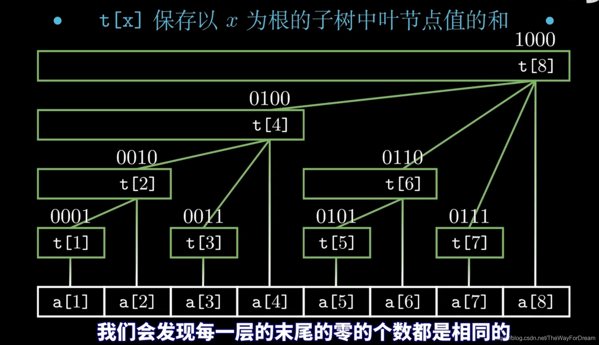

## 区间查询

只要求查询的情况下一般使用前缀和，

比如 [2,4,1,5,7,9]

前缀和：[0,2,6,7,12,19,28]

可以O(1)区间查询，如果我们需要同时进行区间查询和区间修改就需要反复进行前缀和操作；时间复杂度非常高

## lowbit 位运算

定义：lowbit 运算 ：x&(~x+1)

我们观察lowbit 操作：

> lowbit(1)==1&(~1+1)==0001(bit)&(1110(bit)+(0001)(bit))==0001&1111==1;

> lowbit (2)==2

>lowbit(3)==1

.......

我们观察到，lowbit()操作可以返回x的二进制形式中最后一个1开始是二进制串；

比如lowbit(bin1000100)==bin100;

```python
def lowbit(x):
    return x&(~x+1)

```

```cpp
int lowbit(int x) {
    return x & (-x);
}

```

## 关于树状数组的构建




如上图，tree[i]所覆盖的和是lowbit(i)，所以我们可以说树状数组是一种变形的前缀和数组。


如果想要构建树状数组可以通过先构建一个辅助的前缀和数组帮助构建tree数组；

```python
#pypy3
def buildtree(s):
    tree=[0]#树状数组
    op=0
    qzh=[0]#前缀和数组
    for i in range(len(s)):
        x=i+1
        op+=s[i]
        qzh.append(op)
        tree.append(op-(qzh[x-lowbit(x)]))
    del qzh
    return tree

```

```cpp
#include <vector>
using namespace std;

int lowbit(int x) {
    return x & (-x);
}

vector<int> buildTree(const vector<int>& s) {
    vector<int> tree(1, 0); // 以0开始初始化
    int op = 0;
    vector<int> qzh(1, 0); // 累加和，以0开始初始化
    for (int i = 0; i < s.size(); ++i) {
        int x = i + 1;
        op += s[i];
        qzh.push_back(op);
        tree.push_back(op - (qzh[x - lowbit(x)]));
    }
    return tree;
}
```

## 区间查询

前面提到，树状数组就是一种前缀和数组；

那么我们也可以按照前缀和的做法解决树状数组的区间查询问题；

只要构建出前缀和[right]-前缀和[left-1]就可以，那么我们应该如何构建前缀和呢？

我们发现tree[x]包含x-lowbit(x)到x的元素和，那么我们只需要不断更新x直到x=0;这样就涵盖了0-原始x的所有元素

于是我们写出以下代码求关于x的前缀和。

```python
def findqzh(x,tree):
    ans=0
    while x!=0:
        ans+=tree[x]
        x-=lowbit(x)
    return ans
```

```cpp
int findqzh(int x, const vector<int>& tree) {
    int ans = 0;
    while (x != 0) {
        ans += tree[x];
        x -= lowbit(x);
    }
    return ans;
}

```

同时也可以得到区间查询的代码

```python
def findqj(l,r,tree):
    return findqzh(r,tree)-findqzh(l-1,tree)
```


## 单点修改

