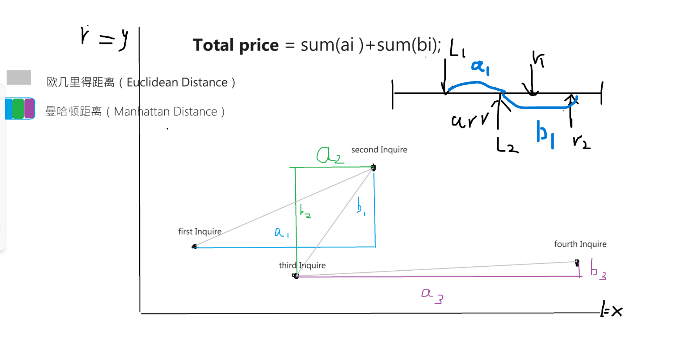
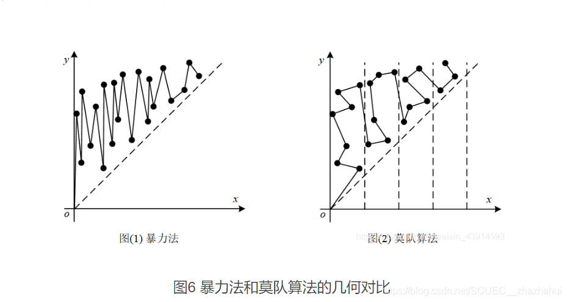

<!--
 * @Author: Z-Es-0 141395766+Z-Es-0@users.noreply.github.com
 * @Date: 2024-08-16 23:04:16
 * @LastEditors: Z-Es-0 141395766+Z-Es-0@users.noreply.github.com
 * @LastEditTime: 2024-08-17 15:15:02
 * @FilePath: \Algorithm-learning-and-communication\算法\分块\分块.md
 * @Description: 这是默认设置,请设置`customMade`, 打开koroFileHeader查看配置 进行设置: https://github.com/OBKoro1/koro1FileHeader/wiki/%E9%85%8D%E7%BD%AE
-->
# 分块

把数列分成很多块；对块做整体的维护操作；而不是完全暴力

# 莫队

分块优化

## 分块操作

块大小 根号n

块数量 根号n

块的左右边界 

元素属于哪个块

通常情况下，块的大小为 
n
n
​
 ，因此块 
i
i 的左右边界可以表示为 [i \times \sqrt{n}, (i+1) \times \sqrt{n} - 1]。元素 
a
[
j
]
a[j] 属于块 i 的条件是 i \times \sqrt{n} \leq j < (i+1) \times \sqrt{n}。

## 分块思想

若操作的数据覆盖的一个块；就对这个块进行整体修改

碎片枚举： 非整块直接暴力

非常的暴力，但是可以大砍复杂度；只能作为小优化，很难作为正确的优化手段

## 莫队优化

莫队是结合了分块和离线查询的简单算法

比如我们在做 ***区间处理问题*** 时

考虑**转移**的成本： 成本为前一个查询到后一个查询的**曼哈顿距离**(2维，3维通用)；

两个查询之间的曼哈顿距离可以表示为 
∣
l
2
−
l
1
∣
+
∣
r
2
−
r
1
∣
∣l 
2
​
 −l 
1
​
 ∣+∣r 
2
​
 −r 
1
​
 ∣，其中 
l
1
,
r
1
l 
1
​
 ,r 
1
​
  和 
l
2
,
r
2
l 
2
​
 ,r 
2
​
  分别是两个查询的左端点和右端点。

如图：

*** 

那么很简单的优化思路就是减少曼哈顿距离；

### 如何减少曼哈顿距离？

### 凡人版优化策略

***

我们对查询进行排序；按查询的l排序；

那么我们保证了l指针一定递增；这时在上图中的查询2和查询3就会优化一点；

下图左为普通优化的欧几里得距离；

### 莫队算法优化

上图右为莫队算法的欧几里得距离 ；

我们将按l属于的块进行排序，在相同块内按r属于的块排序；

这样我们保证了在一个块内的查询是按r单调递增的关系；

减少运行效率较大的地方是区间交接处；但是我们只要根号n个区间；

这样的算法调和了l和r带来的运算量；一定程度上优化了时间复杂度；

## 本质上都是对查询的排序；

所以莫队思想是一种调和左右指针对复杂度贡献的算法，利用查询的相关性

## 局限性

莫队算法主要适用于离线查询，即所有查询在开始处理之前都已知且可以排序。如果查询是在线的，莫队算法就不太适用了。